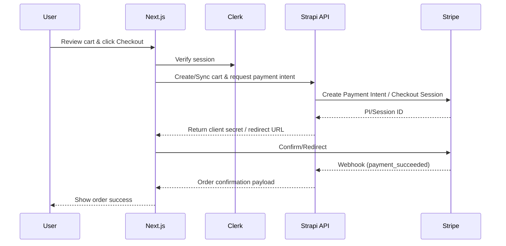

# NextLevel
Full-stack e-commerce built with **Next.js** + **Strapi** + **Stripe** + **Clerk** + **Tailwind CSS**. Browse products, manage carts, check out securely, and administer catalog/content with a Strapi-powered admin. Media is hosted on Cloudinary; design is fully responsive.

---

## Table of Contents
- [Tech Stack](#tech-stack)
- [Architecture](#architecture)
- [Data Model](#data-model)
- [Core Flows](#core-flows)
- [Features](#features)
- [Getting Started](#getting-started)
- [Environment Variables](#environment-variables)
- [Scripts](#scripts)
- [Project Structure](#project-structure)
- [Testing](#testing)
- [Operational Notes](#operational-notes)
- [Roadmap](#roadmap)
- [License](#license)

---

## Tech Stack
- **Frontend**: Next.js (App Router), React, TypeScript (if enabled), Tailwind CSS
- **Backend**: Strapi (Headless CMS), REST/GraphQL (depending on Strapi config)
- **Auth**: Clerk
- **Payments**: Stripe Checkout / Payment Intents
- **Media**: Cloudinary
- **Infra**: Vercel (frontend), Strapi host (Render/Railway/DigitalOcean—configure as applicable)
- **State/Data**: React Query / SWR (adjust if different), local storage for carts (guest), server cart for authed users

---

## Architecture
```mermaid
flowchart LR
  subgraph Client [Next.js (Vercel)]
    UI[UI / Pages]
    Cart[Cart State]
    Fetch[Data Fetching]
  end

  subgraph Strapi [Strapi CMS/API]
    AuthZ[Role & Permissions]
    Webhooks[Webhooks]
  end

  subgraph Integrations
    Stripe[(Stripe)]
    Clerk[(Clerk)]
    Cloudinary[(Cloudinary)]
  end

  UI --> Fetch
  Fetch --> Strapi
  UI --> Clerk
  Cart --> UI
  Strapi --> Cloudinary
  UI --> Stripe
  Stripe --> Strapi
  Strapi --> Webhooks --> UI
```

---

## Data Model
> Align table/collection names and fields with your actual Strapi schema.

```mermaid
erDiagram
  USERS {
    uuid id PK
    string email
    string clerk_id
    string name
    string avatar_url
    timestamp created_at
    timestamp updated_at
  }

  PRODUCTS {
    uuid id PK
    string title
    text description
    uuid category_id FK
    decimal price
    string currency
    string slug
    string sku
    int inventory
    boolean featured
    json metadata
    timestamp created_at
    timestamp updated_at
  }

  CATEGORIES {
    uuid id PK
    string name
    string slug
    uuid parent_id FK
    timestamp created_at
    timestamp updated_at
  }

  MEDIA {
    uuid id PK
    uuid product_id FK
    string url
    string alt
    int position
  }

  CARTS {
    uuid id PK
    uuid user_id FK (nullable for guest)
    string session_id
    timestamp created_at
    timestamp updated_at
  }

  CART_ITEMS {
    uuid id PK
    uuid cart_id FK
    uuid product_id FK
    int quantity
    decimal unit_price
    decimal line_total
  }

  ORDERS {
    uuid id PK
    uuid user_id FK
    string status
    decimal subtotal
    decimal tax
    decimal shipping
    decimal total
    string currency
    string stripe_payment_intent
    string stripe_checkout_id
    timestamp placed_at
    timestamp created_at
    timestamp updated_at
  }

  ORDER_ITEMS {
    uuid id PK
    uuid order_id FK
    uuid product_id FK
    int quantity
    decimal unit_price
    decimal line_total
  }

  ADDRESSES {
    uuid id PK
    uuid user_id FK
    string type
    string line1
    string line2
    string city
    string state
    string postal_code
    string country
    boolean is_default
  }

  USERS ||--o{ CARTS : owns
  USERS ||--o{ ORDERS : places
  USERS ||--o{ ADDRESSES : has
  CATEGORIES ||--o{ PRODUCTS : contains
  PRODUCTS ||--o{ MEDIA : has
  CARTS ||--o{ CART_ITEMS : contains
  PRODUCTS ||--o{ CART_ITEMS : referenced
  ORDERS ||--o{ ORDER_ITEMS : contains
  PRODUCTS ||--o{ ORDER_ITEMS : referenced
```

---

## Core Flows

### Checkout (Authenticated)


### Media Lifecycle
- Upload via Strapi → stored on Cloudinary.
- URLs served directly (opt: image optimization via Next.js `<Image>`).

### Admin Flow (Strapi)
- Manage products, categories, media, and feature flags.
- Role-based permissions for publishing.

---

## Features
- Product listing, detail, search, and category browsing
- Cart (guest + authenticated), quantity updates, persistence
- Secure checkout with Stripe
- Order history and detail pages
- Clerk authentication (email/password, SSO, social where enabled)
- Responsive UI with Tailwind
- Cloudinary-backed media with alt text
- Admin: products/categories/media management (via Strapi)
- SEO-friendly metadata (slugged products/categories)

---

## Getting Started

### Prerequisites
- Node.js ≥ 18
- Yarn or npm or pnpm
- Stripe account + keys
- Clerk instance + keys
- Cloudinary account + keys
- Strapi instance (local or hosted)

### Setup
1) Clone:
```bash
git clone https://github.com/oussamatght/nextlevel.git
cd nextlevel
```

2) Install deps:
```bash
npm install
# or
yarn install
# or
pnpm install
```

3) Configure environment (see `.env.example` below) and ensure Strapi is reachable.

4) Run dev:
```bash
npm run dev
# or
yarn dev
# or
pnpm dev
```

5) Build & start (production):
```bash
npm run build && npm run start
```

---

## Environment Variables
Create `.env.local` (frontend) and `.env` (Strapi) as needed.

```
# Frontend (Next.js)
NEXT_PUBLIC_SITE_URL=http://localhost:3000
NEXT_PUBLIC_API_URL=http://localhost:1337
NEXT_PUBLIC_CLERK_PUBLISHABLE_KEY=pk_test_***
CLERK_SECRET_KEY=sk_test_***
STRIPE_SECRET_KEY=sk_test_***
STRIPE_WEBHOOK_SECRET=whsec_***
NEXT_PUBLIC_STRIPE_PUBLISHABLE_KEY=pk_test_***
NEXT_PUBLIC_CLOUDINARY_CLOUD_NAME=your_cloud
NEXT_PUBLIC_CLOUDINARY_UPLOAD_PRESET=unsigned_or_preset
```

Strapi-side env (example—align to your deployment):
```
APP_KEYS=...
API_TOKEN_SALT=...
ADMIN_JWT_SECRET=...
TRANSFER_TOKEN_SALT=...
STRAPI_URL=http://localhost:1337
CLOUDINARY_NAME=...
CLOUDINARY_KEY=...
CLOUDINARY_SECRET=...
STRIPE_SECRET_KEY=sk_test_***
STRIPE_WEBHOOK_SECRET=whsec_***
CLERK_SECRET_KEY=sk_test_***   # if validating Clerk server-side
```

---

## Scripts
- `dev` — start Next.js dev server
- `build` — build production bundle
- `start` — start production server
- `lint` — run lint checks
- `test` — (add your test runner, e.g., Jest/Playwright)

---

## Project Structure (proposed)
```
nextlevel/
  app/ or pages/          # Next.js routes
  components/             # UI components
  lib/                    # API clients, helpers
  hooks/                  # React hooks (cart, auth, data fetching)
  styles/                 # Tailwind/global styles
  public/                 # Static assets
  scripts/                # Setup/seed (optional)
  tests/                  # Unit/e2e tests
```

---

## Testing
- **Unit**: Jest / Vitest
- **E2E**: Playwright / Cypress
- **API**: Supertest or direct fetch against Strapi (staging)
Add test commands once configured (e.g., `npm run test`, `npm run test:e2e`).

---

## Operational Notes
- **Webhooks**: Ensure Stripe webhooks are configured to notify Strapi (payment success/failure).
- **Caching**: If using ISR/SSG, revalidate on product/category changes (consider Strapi webhooks to trigger revalidation).
- **Security**: Keep secrets out of client bundle; use Next.js server routes where needed.
- **Performance**: Optimize images via Cloudinary transformations or Next.js `<Image>` with remote loader.

---

## Roadmap (suggested)
- Wishlist & product reviews
- Inventory reservations during checkout
- Discount codes / promotions
- Search with filters & sorting
- Accessibility sweeps (WCAG AA)
- Observability (logging, metrics, tracing)

---

## License
MIT (adjust if different).
